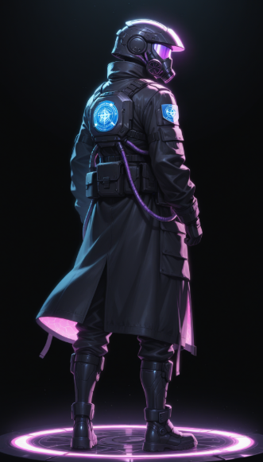
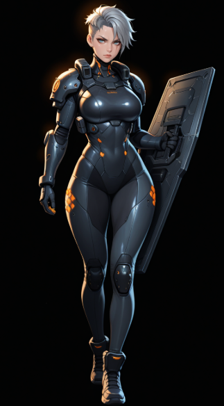
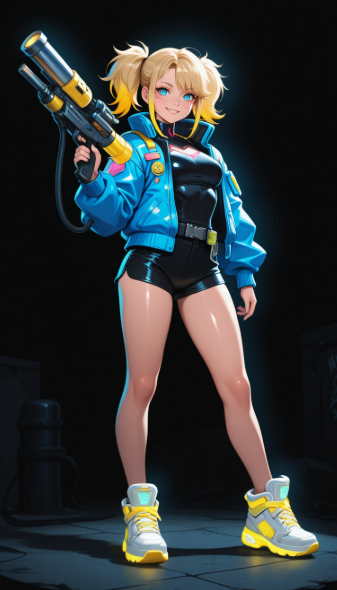
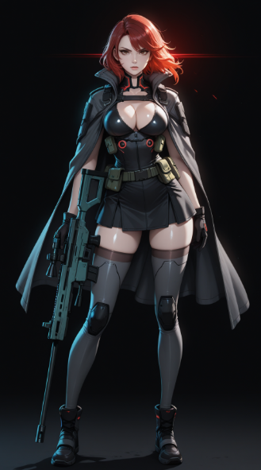
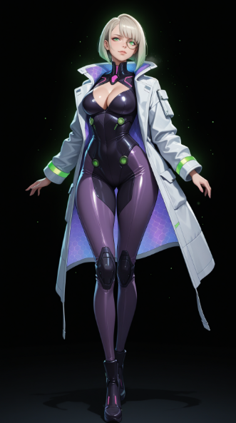

# 캐릭터

> 5명의 동료와 위버(플레이어)로 구성. 전투 시 위버 + 3인 파티를 편성한다.

---

## 위버 (Weaver) — 플레이어 캐릭터

{ width="300" }

**직책**: 테세라 제3구역 집행관 (Lead Executor of District 3)

> "침묵하는 도시의 눈 (The Silent Eye of Tessera)"

얼굴을 드러내지 않는 무표정한 집행관. 인간미보다는 시스템의 의지를 대변하는 '모놀리스(거대 비석)'와 같은 존재감을 가진다. 대화문에서 위버의 대사는 거의 등장하지 않거나 "……"으로 표현된다.

| 항목 | 내용 |
|------|------|
| 디자인 키워드 | 페이스리스, 택티컬 테크웨어, 무광 블랙, 데이터 레이어 |
| 헬멧 | Argus Visor — 완전 밀폐형 풀페이스. 청백색 LED 라인. 연산 시 4×4 그리드 패턴 출현 |
| 핵심 장비 | 아라크네(Arachne) — 왼쪽 팔뚝 장착 가젯. 홀로그램 4×4 그리드 사출 |
| 컬러 팔레트 | 매트 블랙 / 다크 차콜 / 일렉트릭 시안 / 웜 화이트 |

**행동 특성**: 전투 중에도 큰 동작 없이 제자리에서 손가락 끝으로 그리드만 조작. 화려하게 움직이는 동료들과 대비되는 '폭풍의 눈' 같은 정적인 카리스마.

---

## 케스트럴 (Kestrel) — 탱커

{ width="300" }

**직책**: 제3구역 전술 방어 팀장 (Tactical Defense Lead)
**전투 역할**: 탱커 — 그리드 내 장벽 타일 생성, 적 공격 차단 및 타일 이동 제한

| 항목 | 내용 |
|------|------|
| 신체 | 178cm / 68kg / 역삼각형 체형 |
| 헤어 | 차가운 은회색(Ash Gray) 숏컷 또는 언더컷 |
| 눈매 | 날카롭고 강인한 눈빛. 왼쪽 눈가 옅은 흉터 |
| 흉터 | 왼쪽 어깨~쇄골 화상 흉터 (과거 기지 폭발). 본인은 훈장처럼 여김 |
| 강화 골격 | 칠대 열강 소속 당시 시술받은 충격 흡수용 인공 골격 내장 |
| 핵심 장비 | 베스천(The Bastion) — 거대 직사각형 금속 방패. 고단계 타일 연결 시 충격파 방출 |
| 컬러 팔레트 | 스틸 그레이 / 세이프티 오렌지 / 다크 네이비 |

**위버와의 관계**: 팀의 선두를 맡는 실질적 물리 방어선. 뜨겁고 단단한 '철의 여인'.

---

## 주베 (Jube) — 스카우트

{ width="300" }

**직책**: 제3구역 현장 정찰 및 기동 지원 (Field Scout & Maneuver)
**전투 역할**: 스카우트 — 낮은 숫자 타일 빠르게 합치기, 특정 위치로 타일 강제 이동

| 항목 | 내용 |
|------|------|
| 신체 | 156cm / 46kg / 린 애슬레틱 체형 (팀 최단신) |
| 헤어 | 네온 옐로우(Neon Yellow) 끝처리 양갈래 머리 또는 삐죽삐죽 단발 |
| 표정 | 항상 자신만만한 미소. 뺨에 기름때나 반창고 |
| 특징 | 왼쪽 팔뚝 네온 옐로우 데이터 코드 타투 (과거 오리진 복선) |
| 핵심 장비 | 슬라이더(The Sliders) — 부스터 슈즈. 저단계 타일 합치면 고속 이동 발동 |
| 보조 장비 | 조커(The Joker) — 폐기물로 직접 만든 커스텀 연산 패드 |
| 컬러 팔레트 | 네온 옐로우 / 그래파이트 블랙 / 일렉트릭 퍼플 |

**위버와의 관계**: 팀 내 유일하게 위버를 "선생님(Sensei)"이라 부름. 위버의 의도를 가장 먼저 눈치채고 행동으로 옮기는 인물.

---

## 베인 (Vane) — 스나이퍼

{ width="300" }

**직책**: 제3구역 정밀 타격 및 처형 요원 (Precision Strike & Executioner)
**전투 역할**: 스나이퍼 — 고단계 타일(512, 1024 이상) 소모 → 강력한 단일 딜링

| 항목 | 내용 |
|------|------|
| 신체 | 172cm / 56kg / 슬림 앤 샤프 체형 |
| 헤어 | 불타는 듯한 선명한 크림슨 레드(Crimson Red) |
| 눈 | 오른쪽: 붉은색 광학 강화 렌즈(Cybernetic Eye) 이식. 원거리 데이터 흐름 포착 |
| 피부 | 창백한 흰 피부. 붉은 머리와 강렬한 대비 |
| 척추 인터페이스 | 목덜미~척추 금속 단자. 고단계 컴파일 수신 시 붉게 달아오름 |
| 핵심 장비 | 라스트 노트(The Last Note) — 대구경 레일건. 고단계 타일 완성 시 장갑·방어막 동시 관통 |
| 복식 | Ghost-Ops 스텔스 슈트 + 택티컬 클록(펜움브라 당시 유품 망토) |
| 컬러 팔레트 | 크림슨 레드 / 옵시디언 블랙 / 포그 그레이 |

**위버와의 관계**: 위버를 지휘관으로 존중. 위버가 최적 타이밍을 만들어주면 단 한 발로 부응하는 '가장 정밀한 총구'. 이번 전쟁은 임무인 동시에 사적인 복수.

---

## 사이퍼 (Cipher) — 호크

{ width="300" }

**직책**: 제3구역 정보 분석 및 전술 해킹 요원 (Tactical Intel & System Hacking)
**전투 역할**: 호크 — 적 다음 패턴 사전 표시, 특정 타일 취약 상태 부여, 디버프

| 항목 | 내용 |
|------|------|
| 신체 | 168cm / 53kg / 리파인드 아워글래스 체형 |
| 헤어 | 백금발(Platinum Blonde) 또는 짙은 보라색 비대칭 단발 |
| 눈매 | 가늘고 예리한 눈매. HUD 모노클 착용 |
| 바이오 임플란트 | 귓바퀴 뒷면·관자놀이 은색 회로. 해킹 시 에메랄드빛 전류 흐름 |
| 피부 | 기업 재생 의료 기술로 흉터 없는 도자기 피부 |
| 핵심 장비 | 헤르메스(Hermes) — 주변을 떠다니는 3개의 소형 육각형 드론. 적 취약 노드 투사 |
| 특수 장비 | 모이라이(Moirai) — 왼쪽 눈 전술 모노클. 암호 흐름·적 심박수·공공 장부 실시간 표시 |
| 컬러 팔레트 | 로열 퍼플 / 새틴 실버 / 에메랄드 그린 |

**위버와의 관계**: 위버를 '흥미로운 연구 대상'으로 여김. 위버의 침묵을 가장 즐기는 인물. 기업과의 이중 계약이 팀을 위기에 빠뜨릴 가능성을 내포한 복선 캐릭터.

---

## 펄스 (Pulse) — 서스테이너

{ width="300" }

**직책**: 제3구역 의료 지원 및 시스템 안정화 요원 (Medical Support & System Stabilization)
**전투 역할**: 서스테이너 — 타일 합칠 때마다 체력 회복, 방해 타일(오염된 코드) 정화

| 항목 | 내용 |
|------|------|
| 신체 | 165cm / 52kg / 소프트 커브 체형 |
| 헤어 | 탐스러운 검은색 드릴 헤어. 치유 에너지 방출 시 끝부분 핑크빛 발광 |
| 눈 | 아주르 블루(Azure Blue). 생명을 향한 집념과 냉철한 의지를 상징 |
| 핵심 장비 | 에테르(Aether) — 지팡이·건틀릿 형태 바이오 필드 발생기. 핑크빛 나노 입자 살포 |
| 스킬 연출 | 고단계 타일 완성 시 분홍색 심장박동 파동(Pulse Wave)이 전장을 휩쓸며 아군 치유 |
| 컬러 팔레트 | 퓨어 화이트 / 네온 핑크 / 아주르 블루 / 제트 블랙 |

**위버와의 관계**: 위버에게 '브레이크' 같은 존재. 위버가 효율만을 위한 컴파일을 하려 할 때 손을 겹쳐 제지한다. 위버의 침묵 속 고뇌를 이해하는 몇 안 되는 인물.

---

## 파티 구성

전투 시 위버 + 동료 3인을 편성한다. 5인의 역할 분포:

| 역할 | 캐릭터 | 핵심 기능 |
|------|--------|-----------|
| 탱커 | 케스트럴 | 장벽 타일 생성, 적 공격 차단 |
| 스카우트 | 주베 | 저단계 타일 빠른 합성, 타일 강제 이동 |
| 스나이퍼 | 베인 | 고단계 타일 소모 → 강력 단일 딜 |
| 호크 | 사이퍼 | 적 패턴 사전 표시, 취약 노드 생성 |
| 서스테이너 | 펄스 | 체력 회복, 방해 타일 정화 |
