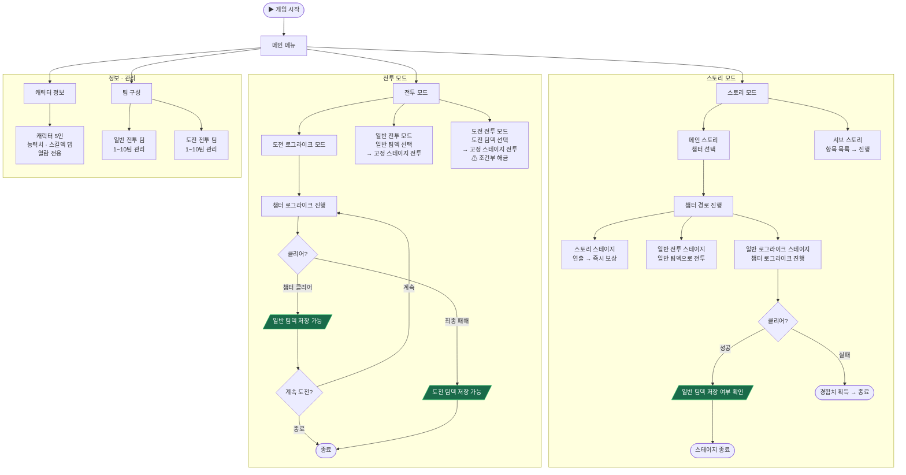

# 아웃게임 시스템

게임 전반의 모드 구성 및 전투 외 화면을 정의한다.

[🖥 UI 목업 보기](outgame_mockup.html){ .md-button .md-button--primary target="_blank" }
[🗺 구조 순서도 보기](outgame_flowchart.html){ .md-button target="_blank" }

---

## 전체 구조 순서도

[🗺 별도 페이지로 보기](outgame_flowchart.html){ .md-button target="_blank" }

---

## 게임 모드 구성

| 모드 | 설명 | 사용 덱 |
|------|------|---------|
| **스토리 모드** | 메인·서브 스토리를 챕터 단위로 진행하는 핵심 콘텐츠 | 로그라이크 방식 (챕터 내 구성) |
| **도전 로그라이크 모드** | 챕터 클리어 후 계속 도전 가능한 반복 챌린지 | 로그라이크 방식 (챕터 내 구성) |
| **일반 전투 모드** | 저장된 일반 팀덱으로 고정 스테이지 리스트 도전 | 일반 팀덱 |
| **도전 전투 모드** | 저장된 도전 팀덱으로 고정 스테이지 리스트 도전 (조건부 해금) | 도전 팀덱 |

---

## 스테이지 타입

전투 스테이지는 4가지 타입으로 분류된다.

| 타입 | 설명 | 사용 모드 |
|------|------|----------|
| **일반 전투 스테이지** | 저장된 일반 팀덱으로 진행하는 단일 전투. 스토리 모드에서 스토리 연출과 함께 배치됨 | 스토리 모드, 일반 전투 모드 |
| **일반 로그라이크 스테이지** | 챕터 로그라이크 방식으로 진행. 클리어 후 일반 팀덱 저장 가능. 스토리 모드에 챕터당 1개 배치 | 스토리 모드 |
| **도전 로그라이크 스테이지** | 챕터 로그라이크 방식으로 진행. 클리어 후 계속 도전 가능. 최종 패배 시 도전 팀덱 저장 가능 | 도전 로그라이크 모드 |
| **도전 전투 스테이지** | 저장된 도전 팀덱으로 진행하는 단일 전투 | 도전 전투 모드 |

챕터 로그라이크 방식의 상세 구조(막 구성, 경로 선택, 스테이지 종류 등)는 [스테이지 진행 시스템](systems/stage.md)을 참조한다.

---

## 스토리 모드

### 메인 스토리

게임의 핵심 콘텐츠. 세계관 전체 스토리를 챕터 단위로 순차 진행한다.

- 챕터가 순서대로 나열되어 있으며, 일부 구간은 분기가 존재한다.
- 하나의 챕터에 **일반 로그라이크 스테이지 1개**, **일반 전투 스테이지**, **스토리 스테이지**가 배치된다.
- 기본적으로 순차 진행이며, 일부 챕터는 다른 콘텐츠 클리어 조건이 붙기도 한다.

### 서브 스토리

캐릭터 개인 스토리나 단편 에피소드를 담은 서브 콘텐츠.

- 특정 조건 달성 시 해금되며, 각 항목이 리스트로 나열된다.
- 개별 서브 스토리는 보통 짧게 완결된다.

### 스토리 스테이지

전투 없이 스토리 연출만 진행되는 스테이지.

| 항목 | 내용 |
|------|------|
| 진행 방식 | 스토리 연출 후 즉시 보상 지급 |
| 재플레이 | 전투 재플레이 불가. 클리어한 스테이지 클릭 시 해당 스토리 연출을 다시 볼 수 있음 |

---

## 전투 모드

### 도전 로그라이크 모드

도전 로그라이크 스테이지를 전담 진행하는 모드. 챕터 구조는 스토리 모드와 동일하나 클리어 후 스테이지가 종료되지 않고 계속 도전한다. 팀 덱 저장 규칙은 아래 [팀 덱 시스템](#team-deck) 섹션 참조.

### 일반 전투 모드

일반 팀덱을 사용하는 고정 스테이지 리스트.

- 스테이지가 순서대로 나열되며 뒤로 갈수록 강한 적이 등장한다.
- 각 스테이지는 고유한 특징(적 구성·특수 조건)이 있어 팀덱 조합 전략이 요구된다.

### 도전 전투 모드

도전 팀덱을 사용하는 고정 스테이지 리스트.

- 도전 팀덱이 더 강하게 구성되는 것을 전제로 기본적으로 컨텐츠 오픈에 조건이 걸려 있다.
- 스테이지가 순서대로 나열되며 뒤로 갈수록 강한 적이 등장한다.

---

## 팀 덱 시스템 {#team-deck}

### 개요

전투 모드에서 사용하는 사전 구성 팀 셋팅. 로그라이크 스테이지를 통해 획득하며 이후 전투 모드에서 재사용한다. 일반 팀덱과 도전 팀덱은 별도로 관리된다.

| 덱 종류 | 획득 방법 | 최대 저장 수 | 사용 모드 |
|---------|-----------|-------------|----------|
| 일반 팀덱 | 일반 로그라이크 클리어 후 저장 | 10개 | 일반 전투 모드 |
| 도전 팀덱 | 도전 로그라이크 최종 패배 후 저장 | 10개 | 도전 전투 모드 |

### 일반 팀덱

- 일반 로그라이크 스테이지 클리어 후 팀덱 저장 여부를 확인한다. 저장 시 일반 팀덱으로 보관된다.
- 저장 가능 시점 기준은 **미정** (예: 3막 이상 진행 완료 시 저장 가능).
- 팀 구성 화면에서 언제든지 삭제할 수 있다.

### 도전 팀덱

- 도전 로그라이크 스테이지 진행 중 챕터 클리어 시점마다 **일반 팀덱**으로 저장하는 것도 가능하다.
- 최종 패배 시 해당 시점의 팀 구성을 **도전 팀덱**으로 저장할 수 있다.
- 일반 팀덱과 별도 목록으로 관리된다.

---

## 캐릭터 정보 화면

보유 캐릭터(기본 5인)의 정보를 확인하는 열람 전용 화면.

| 항목 | 내용 |
|------|------|
| 기본 능력치 | 캐릭터별 체력·공격 등 수치 표시 |
| 스킬덱 | 아래 세 탭으로 구분 확인 |

### 스킬덱 탭

| 탭 | 내용 |
|----|------|
| 기본 스킬덱 | 로그라이크 시작 시 보유하는 초기 카드 목록 |
| 해금 스킬덱 | 현재 획득 가능한 카드 목록 (해금 완료) |
| 미해금 스킬덱 | 아직 해금되지 않은 카드 — 카드 정보 미표시 |

이 화면에서 직접 편집하거나 변경할 수 있는 요소는 없다.

---

## 팀 구성 화면

저장된 팀 덱 목록을 관리하는 화면.

### 규칙 및 동작 방식

- **일반 전투 팀** / **도전 전투 팀** 탭으로 구분된다.
- 각 탭에서 최대 10개 팀을 저장·관리한다.
- 각 팀 항목에는 **출전 캐릭터 3인, 유물, 스킬 셋팅**이 표시된다.
- 팀 번호 순서 이동 및 삭제가 가능하다.
- 팀 삭제 시 뒤 번호 팀이 앞으로 당겨진다.

### 예외 처리

- 최초 1번 팀 셋팅은 기본 구성으로 미리 제공된다.
- 남은 팀이 1개(1번 팀)인 경우 삭제할 수 없다.
