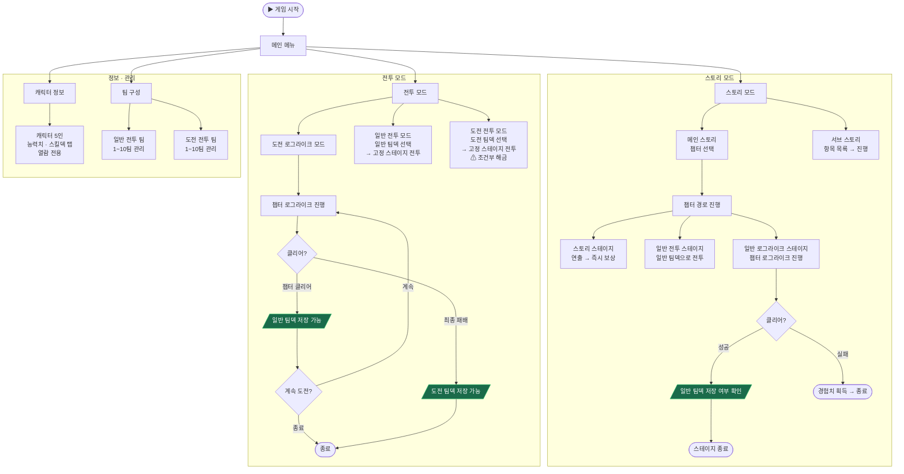

# 아웃게임 전체 구조 순서도

[🗺 크게 보기](outgame_flowchart.html){ .md-button target="_blank" }

```mermaid
flowchart TD
    START([▶ 게임 시작]) --> MENU[메인 메뉴]

    MENU --> SM[스토리 모드]
    MENU --> BM[전투 모드]
    MENU --> CI[캐릭터 정보]
    MENU --> TC[팀 구성]

    subgraph sg_story[스토리 모드]
        SM --> MS[메인 스토리\n챕터 선택]
        SM --> SS[서브 스토리\n항목 목록 → 진행]

        MS --> CH[챕터 경로 진행]
        CH --> STS[스토리 스테이지\n연출 → 즉시 보상]
        CH --> NBS[일반 전투 스테이지\n일반 팀덱으로 전투]
        CH --> NRS[일반 로그라이크 스테이지\n챕터 로그라이크 진행]

        NRS --> NR_CLR{클리어?}
        NR_CLR -->|성공| NR_SAVE[/일반 팀덱 저장 여부 확인/]
        NR_SAVE --> NR_END([스테이지 종료])
        NR_CLR -->|실패| NR_FAIL([경험치 획득 → 종료])
    end

    subgraph sg_battle[전투 모드]
        BM --> CRM[도전 로그라이크 모드]
        BM --> NBM[일반 전투 모드\n일반 팀덱 선택\n→ 고정 스테이지 전투]
        BM --> CBM[도전 전투 모드\n도전 팀덱 선택\n→ 고정 스테이지 전투\n⚠ 조건부 해금]

        CRM --> CR_PLAY[챕터 로그라이크 진행]
        CR_PLAY --> CR_CLR{클리어?}
        CR_CLR -->|챕터 클리어| CR_SAVE_N[/일반 팀덱 저장 가능/]
        CR_SAVE_N --> CR_CONT{계속 도전?}
        CR_CONT -->|계속| CR_PLAY
        CR_CONT -->|종료| CR_END([종료])
        CR_CLR -->|최종 패배| CR_SAVE_C[/도전 팀덱 저장 가능/]
        CR_SAVE_C --> CR_END
    end

    subgraph sg_manage[정보 · 관리]
        CI --> CI_VIEW[캐릭터 5인\n능력치 · 스킬덱 탭\n열람 전용]
        TC --> TC_N[일반 전투 팀\n1~10팀 관리]
        TC --> TC_C[도전 전투 팀\n1~10팀 관리]
    end

    classDef saveNode fill:#1a6b4a,stroke:#2ecc71,color:#fff
    class NR_SAVE,CR_SAVE_N,CR_SAVE_C saveNode
```
