# 아웃게임 UI 레퍼런스

<small style="color:#7070a0;font-family:'Roboto Mono',monospace;background:rgba(255,255,255,0.05);padding:2px 12px;border-radius:20px;border:1px solid rgba(255,255,255,0.08);">📄 docs/outgame_reference.md</small>

아웃게임 화면 설계 참고 자료. 스크린샷은 `docs/assets/references/` 폴더에 저장하면 자동 표시됩니다.

---

## 1. 로비화면 (메인 메뉴)

상단 LV·XP 바 / 우측 세로 네비 패널 / 잠금 아이콘 처리 / 하단 이벤트 배너 / 중앙 캐릭터 일러스트

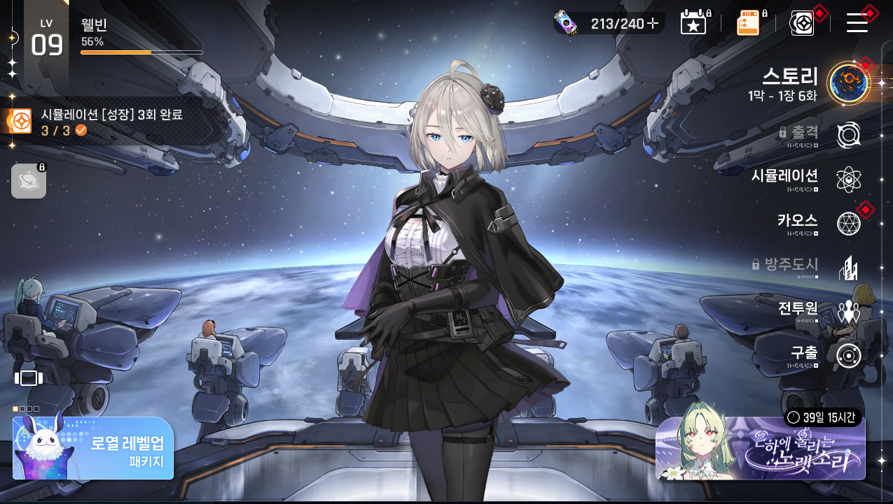

---

## 2. 스토리모드 선택 화면

전체 화면을 2분할하는 대형 카드 / 카드 하단 진행 상황 텍스트 / N 뱃지(신규) / 상단바 뒤로가기 + 홈 + 메뉴

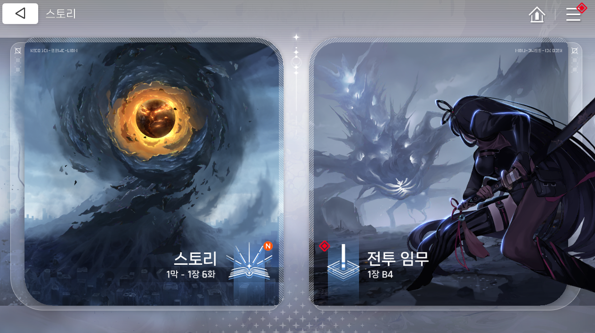

---

## 3. 메인스토리 챕터 선택 (막 선택)

아치형(반원 상단) 카드 3장 / 활성 카드 컬러·하이라이트 / 잠금 카드 흑백 처리 + 자물쇠 아이콘 / 카드 하단 막 번호·이름·진행 화수

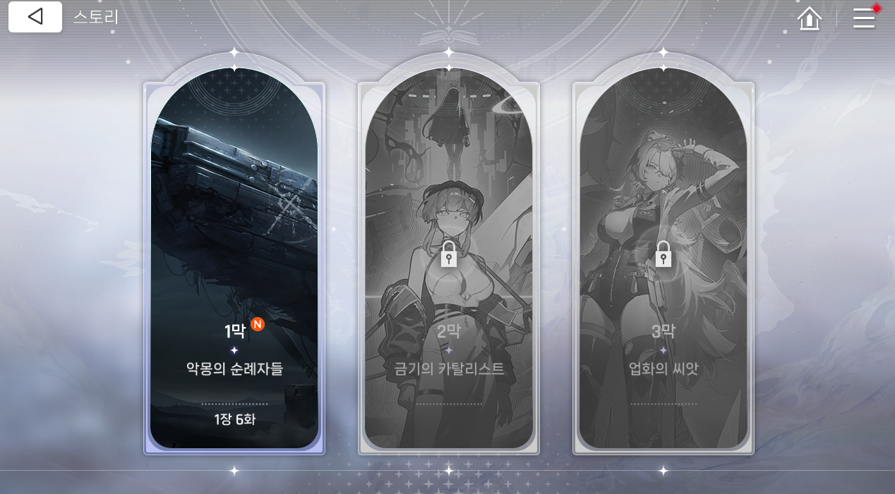

---

## 4. 메인스토리 진행 화면 (스테이지 목록)

좌측 현재 에피소드 제목·진행도 / 가로 타임라인 연결선 / 에피소드 노드 (썸네일 + 완료✓ 뱃지) / 재생·스킵 버튼 / 상단 장 이동 네비 (◁ 1장 N ▷)

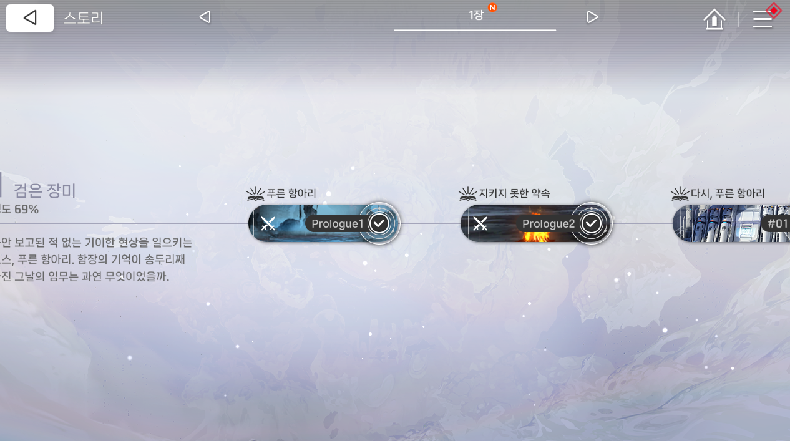

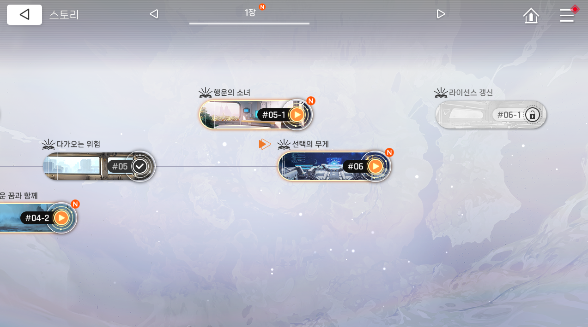

---

## 5. 캐릭터 정보 화면

좌측 캐릭터 썸네일 리스트 / 중앙 대형 캐릭터 일러스트 / 우측 이름·별점·레벨·능력치 테이블·기본 스킬 카드

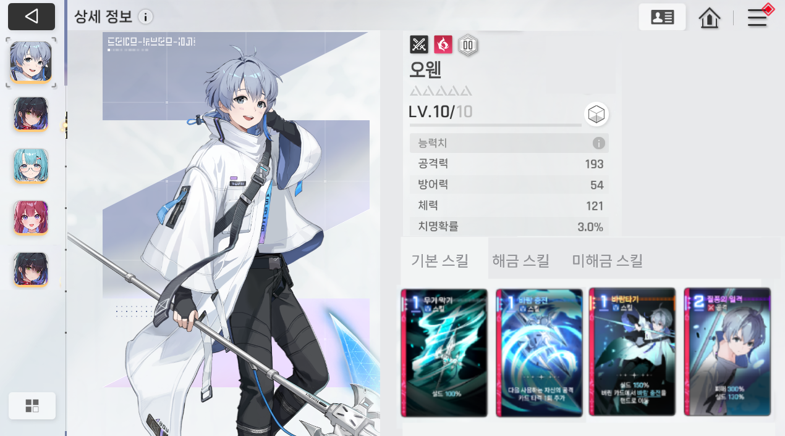

---

## 6. 팀 구성 화면

상단 탭 (일반·도전 전투 팀) + 편집 버튼 / 2열 그리드 팀 슬롯 / 슬롯: 대형 번호 + 캐릭터 초상화 3개

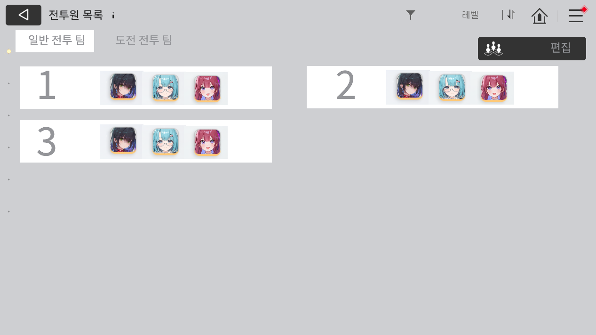

---

## 7. 전투 모드 화면

도전 로그라이크 / 일반 전투 / 도전 전투 모드 카드 선택 / 진행 상황 및 잠금 조건 표시

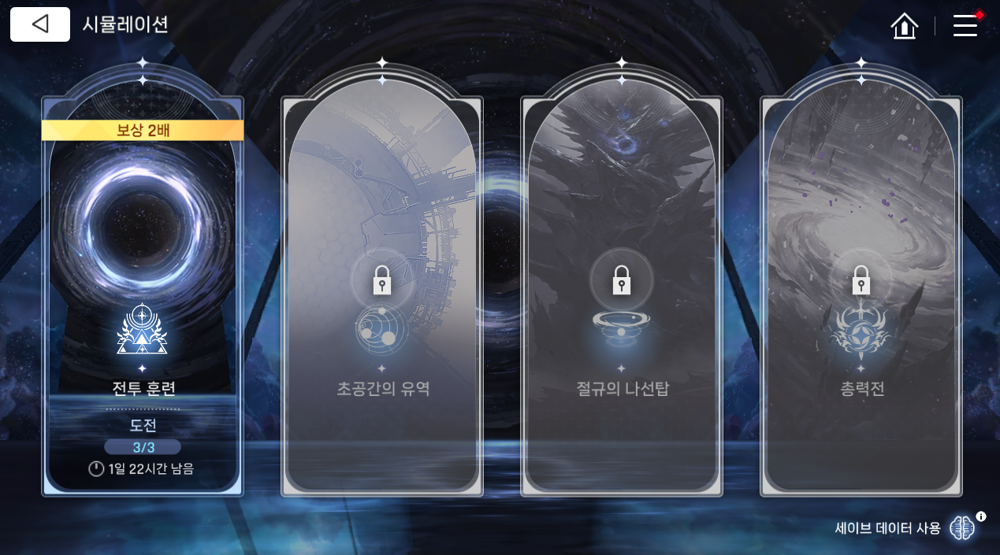

---

## 8. 로그라이크 스테이지 맵

상단 팀 HP + 캐릭터 초상화 / 다이아몬드 노드 분기 경로 맵 / 노드 종류 (전투·미확인·보급) / 현재 위치 핀

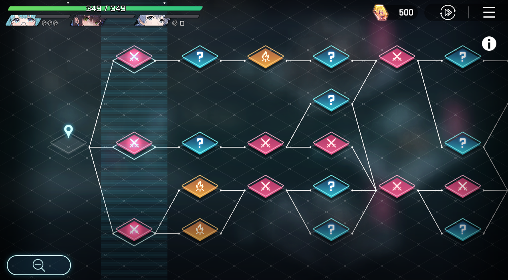

---

## 9. 전투화면 1

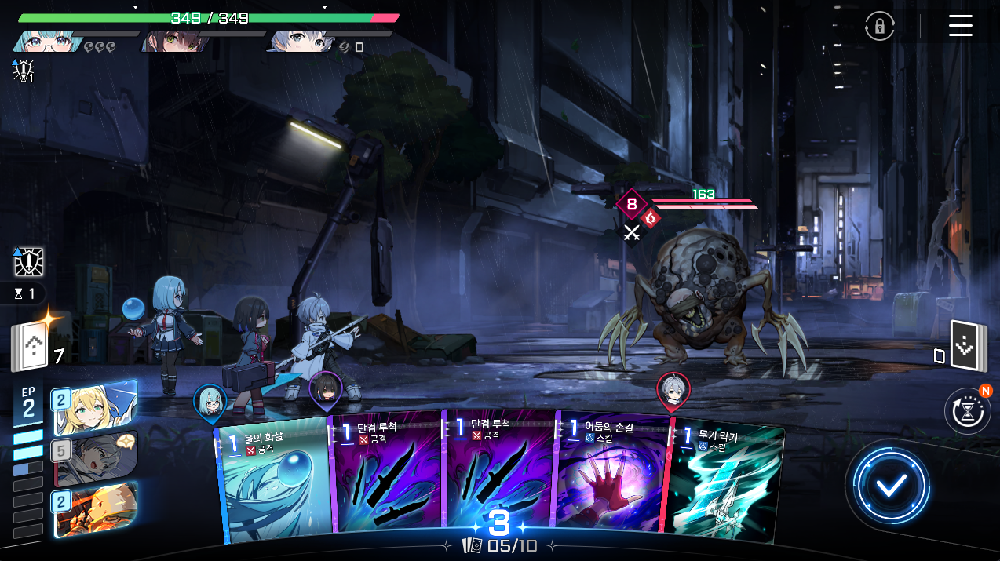

---

## 10. 전투화면 2

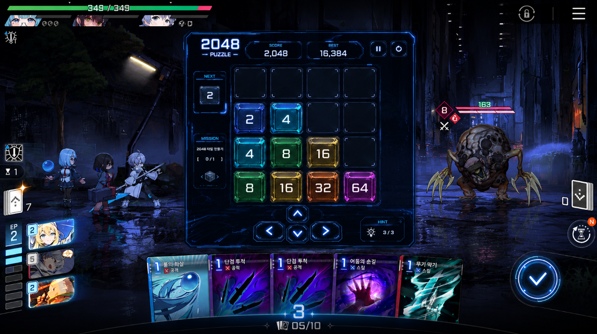
