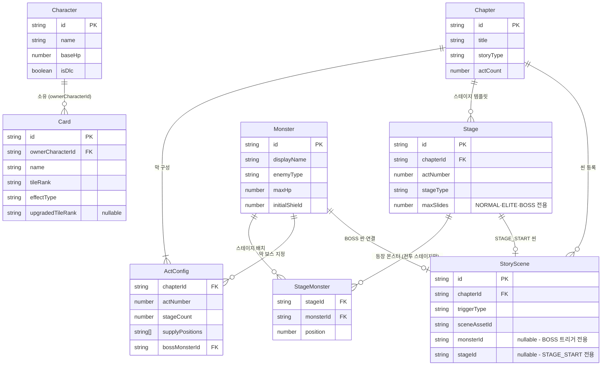
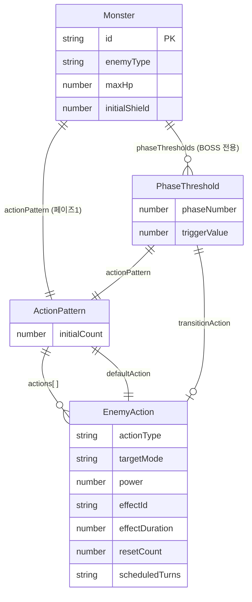
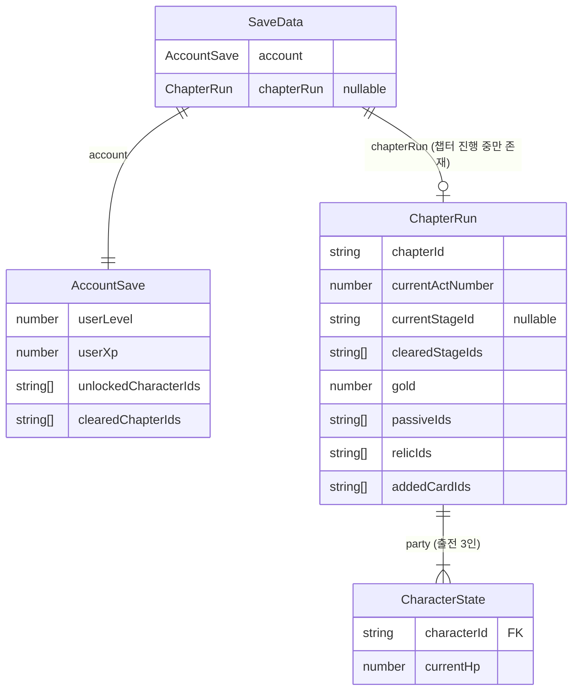

# 스키마 설계

<small style="color:#7070a0;font-family:'Roboto Mono',monospace;background:rgba(255,255,255,0.05);padding:2px 12px;border-radius:20px;border:1px solid rgba(255,255,255,0.08);">📄 docs/schema.md</small>

> 스키마 데이터는 두 계층으로 구분합니다.

| 계층 | 설명 | 생명주기 |
|------|------|----------|
| **기획 테이블** | 기획자가 정의하는 콘텐츠 데이터 | 릴리즈 시점에 확정. 게임 중 변하지 않음 |
| **세이브 데이터** | 플레이어별로 생성·변경되는 진행 데이터 | 로컬 저장소에 유지. 세션 사이에 보존 |

---

## 구조체 목록

| 구조체 | 계층 | 설명 |
|--------|------|------|
| [`Chapter`](#chapter) | 기획 테이블 | 챕터 정의. 막 수·스테이지 구성 설정 |
| [`Stage`](#stage) | 기획 테이블 | 스테이지. 유형·보드 설정·등장 몬스터 포함 |
| [`StoryScene`](#storyscene) | 기획 테이블 | 스토리 씬. 챕터 내 발동 시점과 씬 식별자 |
| [`Character`](#character) | 기획 테이블 | 캐릭터. 체력·DLC 여부 |
| [`Card`](#card) | 기획 테이블 | 스킬 카드. 발동 숫자·등급·효과 파라미터 내포 |
| [`Monster`](#monster) | 기획 테이블 | 적. 행동 패턴·보스 페이즈 내포 |
| [`SaveData`](#savedata) | 세이브 데이터 | 루트 저장 구조체. 영구 계정 데이터와 챕터 진행 상태 포함 |
| [`AccountSave`](#accountsave) | 세이브 데이터 | 챕터 리셋과 무관한 영구 성장 데이터 |
| [`ChapterRun`](#chapterrun) | 세이브 데이터 | 챕터 클리어 시 삭제되는 단일 챕터 진행 상태 |
| [`CharacterState`](#characterstate) | 세이브 데이터 | 챕터 진행 중 파티원 체력 등 상태 |

---

## ERD

### 기획 테이블



### Monster 내부 구조



### 세이브 데이터



---

## 기획 테이블

### Chapter

챕터 정의. 메인 스토리와 서브 스토리 모두 이 구조를 사용한다. 막 구성 상세는 `ActConfig` 참조.

| 필드 | 타입 | 설명 |
|------|------|------|
| `id` | `number` | 챕터 식별자. 순번 그대로. 예: `1`, `8` |
| `title` | `string` | 챕터 표시 제목 |
| `storyType` | `"MAIN" \| "SUB"` | 메인 스토리 또는 서브 스토리 구분 |
| `actCount` | `number` | 막 수. 기본 3. `ActConfig` 항목 수와 일치해야 한다 |

### ActConfig

챕터 내 각 막의 구성 설정. 챕터당 `actCount`개 존재한다.

| 필드 | 타입 | 설명 |
|------|------|------|
| `chapterId` | `number` | `Chapter.id` 참조. 예: `1` |
| `actNumber` | `number` | 막 번호. 1부터 시작 |
| `stageCount` | `number` | 이 막에 배치되는 스테이지 수 (보스 제외) |
| `supplyPositions` | `number[]` | 보급 지역(SUPPLY)이 고정 배치될 위치 인덱스 목록 |
| `bossMonsterId` | `number` | 이 막의 보스로 사용할 `Monster.id`. `enemyType === 'BOSS'`여야 함. 예: `2301` |

---

### Stage

스테이지 템플릿. 챕터 내 전투 스테이지의 보드 설정과 등장 몬스터를 정의한다. 런타임에 경로 생성 시 풀(pool)로 사용된다.

> `SUPPLY`·`UNKNOWN` 유형은 전투가 없으므로 `maxSlides`, `tileSpawnConfig`, `monsters` 필드를 사용하지 않는다.

| 필드 | 타입 | 설명 |
|------|------|------|
| `id` | `number` | 스테이지 식별자. 인코딩: `챕터(1자리) + 막(1자리) + 순번(2자리)`. 예: `10101`=ch1/act1/s1, `80305`=ch8/act3/s5 |
| `chapterId` | `number` | `Chapter.id` 참조. 예: `1` |
| `actNumber` | `number` | 소속 막 번호 |
| `stageType` | [`StageType`](enums.md#stagetype) | 스테이지 유형 |
| `maxSlides` | `number` | 턴당 최대 슬라이드 횟수. `NORMAL`·`ELITE`·`BOSS` 전용 |
| `tileSpawnConfig` | `{ values: number[], weights: number[] }` | 슬라이드 후 타일 생성 확률 분포. `NORMAL`·`ELITE`·`BOSS` 전용 |
| `monsters` | `{ monsterId: number, position: number }[]` | 등장 몬스터 목록. `NORMAL`·`ELITE`·`BOSS` 전용. `position` 오름차순이 화면 위→아래이자 행동 처리 순서 |

**tileSpawnConfig 예시**

| `values` | `weights` | 동작 |
|----------|-----------|------|
| `[2]` | `[1]` | 항상 `2` 생성 (초기 구현 기본값) |
| `[2, 4]` | `[3, 1]` | `2` 75%, `4` 25% |

**제약 조건**

| 항목 | 규칙 |
|------|------|
| `tileSpawnConfig` | `values.length === weights.length`. `weights` 원소는 양의 정수 |
| `monsters` | 1개 이상. `position` 중복 불가. `NORMAL`·`ELITE`·`BOSS` 스테이지만 필수 |
| `stageType === 'BOSS'` | `monsters` 중 `enemyType === 'BOSS'`인 항목이 1개 이상 존재 |

---

### StoryScene

챕터 내 스토리 씬(컷씬·대화) 정의. 발동 시점(`triggerType`)에 따라 어떤 씬을 재생할지 지정한다.

> 발동 시점 상세: [SceneTriggerType](enums.md#scenetriggertype)

| 필드 | 타입 | 설명 |
|------|------|------|
| `id` | `number` | 씬 식별자. 인코딩: `4 + 챕터(1자리) + 순번(2자리)`. 예: `4101`=ch1의 첫 씬 |
| `chapterId` | `number` | `Chapter.id` 참조. 예: `1` |
| `triggerType` | [`SceneTriggerType`](enums.md#scenetriggertype) | 발동 시점 |
| `sceneAssetId` | `string` | 실제 재생할 씬 에셋·스크립트 식별자 |
| `monsterId` | `number \| undefined` | `BOSS_START`·`BOSS_CLEAR` 트리거 전용. 해당 보스의 `Monster.id`. 예: `2301` |
| `stageId` | `number \| undefined` | `STAGE_START` 트리거 전용. 발동할 `Stage.id`. 예: `10101` |

**제약 조건**

| 항목 | 규칙 |
|------|------|
| `BOSS_START`·`BOSS_CLEAR` | `monsterId` 미지정 시 해당 막의 모든 보스에 적용. 특정 보스에만 적용하려면 `monsterId` 지정 필요 |
| `STAGE_START` | `stageId` 필수. 경로 미선택 시 재생 보장 없음 — 필수 서사 배치 지양 |
| `CHAPTER_START` | `monsterId`, `stageId` 모두 불필요 |

---

### Character

플레이어가 출전시킬 수 있는 캐릭터 정의.

> `Card.ownerCharacterId`가 이 `id`를 참조한다. 전투 시작 시 출전한 3인의 카드가 합산되어 덱을 구성한다.

| 필드 | 타입 | 설명 |
|------|------|------|
| `id` | `number` | 캐릭터 식별자. 인코딩: `1 + 순번(3자리)`. 예: `1001`~`1005` |
| `name` | `string` | 화면 표시 이름 |
| `baseHp` | `number` | 최대 체력 |
| `isDlc` | `boolean` | DLC 캐릭터 여부 |

---

### Card

캐릭터의 스킬 카드 정의. 효과 파라미터(`effectParams`)를 내포한다.

> 카드 발동 흐름: [card.md §5](systems/card.md)

| 필드 | 타입 | 설명 |
|------|------|------|
| `id` | `number` | 카드 식별자. 인코딩: `3 + 캐릭터순번(1자리) + 카드순번(2자리)`. 예: `3101`=케스트럴 1번 카드, `3201`=주베 1번 카드 |
| `ownerCharacterId` | `number` | `Character.id` 참조. 예: `1001` |
| `name` | `string` | 카드 표시 이름 |
| `tileRank` | [`TileRank`](enums.md#tilerank) | 발동에 필요한 타일 숫자 등급. 실제 타일 숫자는 `TileRank` 정의에서 파생 |
| `effectType` | [`CardEffectType`](enums.md#cardeffecttype) | 카드 효과 분류 |
| `effectParams` | `EffectParams` | 효과 실행 파라미터 (아래 참조) |
| `upgradedTileRank` | [`TileRank`](enums.md#tilerank)` \| undefined` | 강화 후 대체 등급. 반드시 `tileRank`보다 낮은 등급이어야 한다 |

**EffectParams**

| 필드 | 타입 | 사용 `effectType` | 설명 |
|------|------|-------------------|------|
| `targetType` | [`TargetType`](enums.md#targettype) | 전체 | 효과 적용 대상 |
| `damage` | `number \| undefined` | `ATTACK` | 피해량 |
| `healAmount` | `number \| undefined` | `HEAL` | 회복량 |
| `buffId` | `string \| undefined` | `BUFF` | 부여할 버프 식별자 |
| `debuffId` | `string \| undefined` | `DEBUFF` | 부여할 디버프 식별자 |
| `duration` | `number \| undefined` | `BUFF`, `DEBUFF` | 효과 지속 액션 버튼 횟수. `0`은 영구 지속 예약값 (미결 C-5) |

---

### Monster

전투에 등장하는 적 정의. 행동 패턴과 보스 페이즈를 내포한다.

> 적 AI 시스템 전체 규칙: [enemy.md](systems/enemy.md)

| 필드 | 타입 | 설명 |
|------|------|------|
| `id` | `number` | 적 식별자. 인코딩: `2 + 타입(1자리: 1=NORMAL/2=ELITE/3=BOSS) + 순번(2자리)`. 예: `2101`=일반1, `2201`=정예1, `2301`=보스1 |
| `displayName` | `string` | 화면 표시 이름 |
| `enemyType` | [`EnemyType`](enums.md#enemytype) | 적 유형 |
| `maxHp` | `number` | 최대 체력 |
| `initialShield` | `number` | 전투 시작 시 방어막. `0`이면 없음 |
| `actionPattern` | `ActionPattern` | 기본 행동 패턴 (아래 참조) |
| `phaseThresholds` | `PhaseThreshold[] \| undefined` | 페이즈 전환 조건. **BOSS 전용** |

#### ActionPattern

| 필드 | 타입 | 설명 |
|------|------|------|
| `initialCount` | `number` | 전투 시작·행동 실행 후 리셋 시 카운트 기본값 |
| `actions` | `EnemyAction[]` | 행동 목록. 고정 순환 방식 기준 인덱스 0부터 반복 (미결 C-2) |
| `defaultAction` | `EnemyAction` | 해당 턴에 `scheduledTurns` 스킬이 없을 때 발동하는 기본 행동 |

#### EnemyAction

| 필드 | 타입 | 설명 |
|------|------|------|
| `actionType` | [`ActionType`](enums.md#actiontype) | 행동 유형 |
| `targetMode` | [`TargetMode`](enums.md#targetmode) | 대상 범위. `ATTACK_AOE`·`BUFF_SELF`는 무시됨 |
| `power` | `number` | 피해량 또는 효과 수치 |
| `effectId` | `string \| undefined` | `DEBUFF`·`BUFF_SELF` 전용. 적용할 효과 식별자 |
| `effectDuration` | `number \| undefined` | 효과 지속 횟수. `0`은 영구 지속 예약값 (미결 C-5) |
| `resetCount` | `number` | 이 행동 실행 후 `actionCount` 리셋값. 현재 `actionPattern.initialCount`와 동일값 사용 (미결 C-1) |
| `scheduledTurns` | `number[] \| undefined` | 지정 턴(액션 버튼 누적 횟수)에만 발동. `undefined`이면 기본 순환에 포함 |

#### PhaseThreshold (BOSS 전용)

> 페이즈 전환 처리 흐름: [enemy.md §6](systems/enemy.md)

| 필드 | 타입 | 설명 |
|------|------|------|
| `phaseNumber` | `number` | 전환될 페이즈 번호. 2 이상 (페이즈 1은 `Monster.actionPattern`이 담당) |
| `triggerValue` | `number` | `currentHp / maxHp ≤ 이 값`일 때 전환. `0.0 ~ 1.0` 체력 비율 (미결 C-4) |
| `actionPattern` | `ActionPattern` | 해당 페이즈의 행동 패턴 |
| `transitionAction` | `EnemyAction \| undefined` | 페이즈 전환 즉시 발동하는 특수 행동 |

**제약 조건**: `phaseThresholds`는 `triggerValue` 내림차순 정렬 권장. `triggerValue`는 `0.0` 초과 `1.0` 미만.

**보스 데이터 예시**

```typescript
const dragonBoss: Monster = {
  id: 2399,
  displayName: "보스 드래곤",
  enemyType: "BOSS",
  maxHp: 500,
  initialShield: 0,
  actionPattern: {
    initialCount: 4,
    actions: [
      { actionType: "ATTACK_SINGLE", targetMode: "SINGLE", power: 20, resetCount: 4 },
      { actionType: "ATTACK_AOE",    targetMode: "ALL",    power: 15, resetCount: 4 },
      { actionType: "BUFF_SELF",     targetMode: "SINGLE", power: 40, effectId: "shield_gain", resetCount: 4 },
    ],
    defaultAction: { actionType: "ATTACK_SINGLE", targetMode: "SINGLE", power: 20, resetCount: 4 },
  },
  phaseThresholds: [
    {
      phaseNumber: 2,
      triggerValue: 0.5,
      transitionAction: { actionType: "ATTACK_AOE", targetMode: "ALL", power: 30, resetCount: 3 },
      actionPattern: {
        initialCount: 3,
        actions: [
          { actionType: "ATTACK_AOE", targetMode: "ALL", power: 20, resetCount: 3 },
          { actionType: "ATTACK_AOE", targetMode: "ALL", power: 20, effectId: "defense_down", effectDuration: 2, resetCount: 3 },
        ],
        defaultAction: { actionType: "ATTACK_AOE", targetMode: "ALL", power: 20, resetCount: 3 },
      },
    },
    {
      phaseNumber: 3,
      triggerValue: 0.25,
      transitionAction: undefined,
      actionPattern: {
        initialCount: 2,
        actions: [
          { actionType: "ATTACK_AOE", targetMode: "ALL", power: 25, resetCount: 2 },
          { actionType: "ATTACK_AOE", targetMode: "ALL", power: 30, resetCount: 2 },
        ],
        defaultAction: { actionType: "ATTACK_AOE", targetMode: "ALL", power: 25, resetCount: 2 },
      },
    },
  ],
}
```

---

## 세이브 데이터

로컬 저장소에 유지된다. 세션 사이에 보존되며 챕터 클리어 또는 영구 성장 두 라이프사이클로 관리된다.

### SaveData

세이브 파일의 루트 구조체.

| 필드 | 타입 | 설명 |
|------|------|------|
| `account` | `AccountSave` | 챕터 리셋과 무관한 영구 데이터 |
| `chapterRun` | `ChapterRun \| null` | 현재 진행 중인 챕터 상태. 챕터 미진행 시 `null` |

---

### AccountSave

챕터 클리어 후에도 유지되는 영구 성장 데이터.

| 필드 | 타입 | 설명 |
|------|------|------|
| `userLevel` | `number` | 유저 레벨. 챕터 플레이 경험치로 상승 |
| `userXp` | `number` | 현재 누적 경험치 |
| `unlockedCharacterIds` | `number[]` | 보유(해금)한 `Character.id` 목록. 예: `[1001, 1002, 1003]` |
| `clearedChapterIds` | `number[]` | 클리어한 챕터 `id` 목록. 예: `[1, 2]` |

> **[미결]** 장비(`Equipment`) 구조 미정. 아웃게임 상점·뽑기 시스템 설계 후 `AccountSave`에 `equipments` 필드 추가 예정.

---

### ChapterRun

단일 챕터 진행 상태. 챕터 클리어 또는 실패 시 `SaveData.chapterRun`을 `null`로 초기화한다.

| 필드 | 타입 | 설명 |
|------|------|------|
| `chapterId` | `number` | 진행 중인 챕터 식별자. 예: `1` |
| `currentActNumber` | `number` | 현재 진행 중인 막 번호 |
| `currentStageId` | `number \| null` | 현재 위치한 `Stage.id`. 예: `10203`. 스테이지 선택 화면일 때 `null` |
| `clearedStageIds` | `number[]` | 이번 챕터에서 클리어한 스테이지 ID 목록. 예: `[10101, 10102]` |
| `party` | `CharacterState[]` | 출전 3인 상태. 배열 순서 = 화면 표시 순서 |
| `gold` | `number` | 현재 보유 골드. 챕터 종료 시 소멸 |
| `passiveIds` | `string[]` | 선택한 챕터 패시브 식별자 목록. 중복 불가 |
| `relicIds` | `string[]` | 보유 유물 식별자 목록. 보스 처치·미확인 지역 이벤트로 획득 |
| `addedCardIds` | `number[]` | 카드 보상으로 덱에 추가된 `Card.id` 목록. 예: `[3101, 3202]` |

**제약 조건**

| 항목 | 규칙 |
|------|------|
| `party` | 길이 고정 3. 모두 `AccountSave.unlockedCharacterIds`에 포함된 값 |
| `passiveIds` | 중복 값 불가 |
| `gold` | 0 이상 정수 |

---

### CharacterState

챕터 진행 중 파티원별 가변 상태.

| 필드 | 타입 | 설명 |
|------|------|------|
| `characterId` | `number` | `Character.id` 참조. 예: `1001` |
| `currentHp` | `number` | 현재 체력. `0`이면 사망. `Character.baseHp` 이하 |

---

## 미결 사항

기획 테이블 구조에 영향을 주는 항목만 정리. 전체 미결 목록은 각 시스템 문서 참조.

| 번호 | 항목 | 영향 필드 | 결정 필요 시점 |
|------|------|-----------|:-----------:|
| **A-1** | 카드 효과 타입 확장 (`SHIELD`·`DRAW` 등) | `CardEffectType`, `EffectParams` | 2단계 착수 전 |
| **C-1** | 카운트 리셋값 방식 (고정 vs 행동별 가변) | `EnemyAction.resetCount` 사용 방식 | 4단계 착수 전 |
| **C-2** | 행동 패턴 구조 확장 (`RANDOM_WEIGHTED`·`CONDITIONAL`) | `ActionPattern.actions` 항목 필드 | 4단계 착수 전 |
| **C-4** | 보스 페이즈 트리거 (체력 비율 vs 절대값) | `PhaseThreshold.triggerValue` 타입·해석 | 4단계 착수 전 |
| **C-5** | 효과 지속 방식 (N턴 vs 영구) | `EnemyAction.effectDuration`, `EffectParams.duration` | 4단계 착수 전 |
| **C-6** | 단일 공격 대상 선택 방식 | `EnemyAction.targetMode` 적용 로직 | 4단계 착수 전 |
