# 스키마 설계

<small style="color:#7070a0;font-family:'Roboto Mono',monospace;background:rgba(255,255,255,0.05);padding:2px 12px;border-radius:20px;border:1px solid rgba(255,255,255,0.08);">📄 docs/schema.md</small>

> 스키마 데이터는 두 계층으로 구분합니다.

| 계층 | 설명 | 생명주기 |
|------|------|----------|
| **기획 테이블** | 기획자가 Google Sheets에서 정의하는 콘텐츠 데이터. 빌드 시 JSON으로 내보내 번들에 포함 | 릴리즈 시점에 확정. 게임 플레이 중 변하지 않음 |
| **세이브 데이터** | 플레이어별로 생성·변경되는 진행 데이터. `ChapterRun`은 챕터 클리어/실패 시 초기화 | 로컬 저장소에 유지. 세션 사이에 보존 |

기획 테이블 시트 구성 상세는 [기획 테이블 시트](data_sheet.md)를 참조한다.

---

## 테이블 연결 구조

각 테이블이 어떤 테이블을 참조하는지 나타낸다. `?`는 선택적 참조(빈 값 허용).

### 카드

| 테이블 | 참조 컬럼 | 참조 대상 |
|--------|-----------|-----------|
| `CardAbilityTBL` | `Status1`, `Status2?` | `CardStatusTBL` |
| `CardAbilityTBL` | `Chain_Ability?` | `CardAbilityTBL` (자기 참조) |
| `CardTBL` | `Ability1`, `Ability2~4?` | `CardAbilityTBL` |
| `CardTBL` | `Team` | `CardTeamTBL` |
| `CardTBL` | `Rarity` | `CardRarityTBL` |
| `CardTBL` | `Trait1?`, `Trait2?` | `CardTraitTBL` |
| `CardTBL` | `Intent?` | `CardIntentTBL` |
| `CardTBL` | `TitleStringID`, `DescStringID` | `StringTBL_KR` |

### 캐릭터

| 테이블 | 참조 컬럼 | 참조 대상 |
|--------|-----------|-----------|
| `StartCardDeckTBL` | `slot1~10?` | `CardTBL` |
| `ChampionTBL` | `StartDeck` | `StartCardDeckTBL` |
| `ChampionTBL` | `Team` | `CardTeamTBL` |
| `ChampionTBL` | `Reward_Card1?`, `Reward_Card2?` | `CardTBL` |
| `ChampionTBL` | `TitleStringID` | `StringTBL_KR` |
| `EnemyTBL` | `CardDeck` | `StartCardDeckTBL` |
| `EnemyTBL` | `Trait1?` | `CardTraitTBL` |
| `EnemyTBL` | `Ability1?` | `CardAbilityTBL` |
| `EnemyTBL` | `TitleStringID` | `StringTBL_KR` |

### 맵

| 테이블 | 참조 컬럼 | 참조 대상 |
|--------|-----------|-----------|
| `MapTBL` | `RandomEventID` | `MapRandomEventTBL` |
| `MapTBL` | `FixedWidthID?` | `MapFixedWidthTBL` |
| `MapTBL` | `FixedEventID?` | `MapFixedEventTBL` |
| `MapTBL` | `TitleStringID` | `StringTBL_KR` |
| `MapRandomEventTBL` | `EventID` | 이벤트 테이블 (`Type` 값에 따라 결정) |
| `MapFixedEventTBL` | `EventID` | 이벤트 테이블 (`Type` 값에 따라 결정) |

### 맵 이벤트

| 테이블 | 참조 컬럼 | 참조 대상 |
|--------|-----------|-----------|
| `MapEvent_BattleTBL` | `Enemy1~4?` | `EnemyTBL` |
| `MapEvent_BattleTBL` | `ExtraEnemy?` | `ExtraEnemyTBL` |
| `MapEvent_BattleTBL` | `Win_Event?` | 이벤트 테이블 |
| `ExtraEnemyTBL` | `Enemy1~4?` × 2세트 | `EnemyTBL` |
| `MapEvent_ChoiceTBL` | `DescStringID` | `StringTBL_KR` |
| `MapEvent_TradeTBL` | `DescStringID` | `StringTBL_KR` |
| `MapEvent_EffectTBL` | `ChainEventID?` | 이벤트 테이블 |
| `MapEvent_EffectTBL` | `DescStringID` | `StringTBL_KR` |

---

## ERD

```mermaid
erDiagram
    StringTBL_KR {
        number UID PK
        string KR
    }
    CardTBL {
        string Type
        number ID PK
        number TitleStringID FK
        number DescStringID FK
        string ArtIcon
        string ArtFull
        string S_CardType
        number CardType
        string S_ItemType
        number ItemType
        number Team FK
        number Rarity FK
        number Mana
        number Trait1 FK
        number Trait2 FK
        number Ability1 FK
        number Ability2 FK
        number Ability3 FK
        number Ability4 FK
        number UpgradeMax
        number UpgradeMana
        number ShopCost
        number Intent FK
        string SpawnFx
        string SpawnAudio
        string CasterAnim
        string TargetAnim
        string SelectAvailability
        number Availability
    }
    CardAbilityTBL {
        string Type
        number ID PK
        string selectTtrigger
        number trigger
        string T_trigCond1
        string T_trigCond2
        string T_trigCond3
        string selectTarget
        number Target
        string T_tgtCond1
        string T_tgtCond2
        string T_tgtCond3
        string Effect1
        string Effect2
        number Status1 FK
        number Status2 FK
        number EffectValue
        number UpgradeValue
        string SelectUpBonus
        number UpgradeBonus
        number Chain_Ability FK
        string Target_Fx
    }
    CardStatusTBL {
        number ID PK
        string selectEffect
        number StatusEffect
        string selectDuration
        number StatusDuration
        boolean IsNegative
        number TitleStringID FK
        number DescStringID FK
        string Icon
        string Fx
        string Animation
    }
    CardTraitTBL {
        number ID PK
        number TitleStringID FK
        number DescStringID FK
        string Icon
    }
    CardTeamTBL {
        number ID PK
        number TitleStringID FK
        string Icon
        string Color
    }
    CardRarityTBL {
        number ID PK
        number TitleStringID FK
        string Icon
        number Probability
    }
    CardIntentTBL {
        number ID PK
        boolean IsShow
        number Priority
        number TitleStringID FK
        number DescStringID FK
        string Icon
    }
    ChampionTBL {
        number ID PK
        number TitleStringID FK
        string ArtFull
        string ArtPortrait
        string Prefab
        number HP
        number Speed
        number Hand
        number Energy
        number LvUp_HP
        number LvUp_Speed
        number LvUp_Hand
        number LvUp_Energy
        number Team FK
        number StartDeck FK
        number Reward_Card1 FK
        number Reward_Card2 FK
    }
    EnemyTBL {
        number ID PK
        number TitleStringID FK
        string ArtFull
        string ArtPortrait
        string Prefab
        number HP
        number Speed
        number Hand
        number Energy
        number LvUp_Max
        number LvUp_HP
        number LvUp_Speed
        number LvUp_Hand
        number LvUp_Energy
        string Behavior
        number Trait1 FK
        number Ability1 FK
        number CardDeck FK
        number Reward_Gold
        number Reward_XP
        string Spawn_Fx
    }
    StartCardDeckTBL {
        string Type
        number ID PK
        number slot1 FK
        number slot2 FK
        number slot3 FK
        number slot4 FK
        number slot5 FK
        number slot6 FK
        number slot7 FK
        number slot8 FK
        number slot9 FK
        number slot10 FK
    }
    MapTBL {
        number ID PK
        number TitleStringID FK
        string MapScene
        string BattleScene
        number Depth
        number Width_min
        number Width_max
        number Fork_probability
        number RandomEventID FK
        number FixedWidthID FK
        number FixedEventID FK
        string Map_tutorial
    }
    MapRandomEventTBL {
        number ID PK
        string Select_type
        number Type
        number EventID FK
    }
    MapFixedWidthTBL {
        number ID PK
        number Depth1
        number Depth2
        number Depth3
        number Depth4
        number Depth5
        number Depth6
        number Depth7
        number Depth8
        number Depth9
        number Depth10
        number Depth11
        number Depth12
    }
    MapFixedEventTBL {
        number ID PK
        number Depth
        number Index_min
        number Index_max
        number EventID FK
    }
    MapEvent_BattleTBL {
        number ID PK
        number Depth_Min
        number Depth_Max
        string Icon
        number EnemyLevel
        number Enemy1 FK
        number Enemy2 FK
        number Enemy3 FK
        number Enemy4 FK
        number ExtraEnemy FK
        number RewardGold
        number RewardXP
        boolean IsRewardCards
        string CardRarity
        boolean IsRewardItem
        string ItemRarity
        string ItemTeam
        string Tutorial
        number Win_Event FK
    }
    ExtraEnemyTBL {
        number ID PK
        number ChampionMin_A
        number Enemy1_A FK
        number Enemy2_A FK
        number Enemy3_A FK
        number Enemy4_A FK
        number ChampionMin_B
        number Enemy1_B FK
        number Enemy2_B FK
        number Enemy3_B FK
        number Enemy4_B FK
    }
    MapEvent_ChoiceTBL {
        number ID PK
        number Depth_Min
        number Depth_Max
        string Icon
        number DescStringID FK
        string Choise1_Title
        string Choise1_Desc
        string Choise1_Effect
        string Choise2_Title
        string Choise2_Desc
        string Choise2_Effect
        string Choise3_Title
        string Choise3_Desc
        string Choise3_Effect
        string Choise4_Title
        string Choise4_Desc
        string Choise4_Effect
    }
    MapEvent_TradeTBL {
        number ID PK
        string Icon
        string SelectEventTarget
        string EventTarget
        string SpendItem
        number SpendGold
        number SpendHp
        string GainItem1
        string GainItem2
        string GainItem3
        string GainAlly
        number GainGold
        number GainXp
        number GainHeal
        number DescStringID FK
    }
    MapEvent_EffectTBL {
        number ID PK
        string Icon
        string Condition1
        string SelectEventTarget
        string EventTarget
        string Effect1
        string Effect2
        number value
        number ChainEventID FK
        number DescStringID FK
    }
    MapEvent_OtherTBL {
        number ID PK
        string SelectType
        string EventType
        string Icon
        string Rarity
        string SelectWorldState
        string WorldState
        boolean FreeUpgrade
    }
    MapEvent_ShopTBL {
        number ID PK
        number Depth_Min
        number Depth_Max
        string Icon
        number Buy_mult
        number Selly_mult
        string Item1
        string Item2
        string Item3
        number Cards_Rand
        number Items_Rand
        string ItemRand_Slot1
        string ItemRand_Slot2
        string ItemRand_Slot3
        string ItemRand_Slot4
    }

    StringTBL_KR ||--o{ CardTBL : "TitleStringID / DescStringID"
    StringTBL_KR ||--o{ CardAbilityTBL : "(없음 — 직접 참조 없음)"
    StringTBL_KR ||--o{ CardStatusTBL : "TitleStringID / DescStringID"
    StringTBL_KR ||--o{ CardTraitTBL : "TitleStringID / DescStringID"
    StringTBL_KR ||--o{ CardTeamTBL : "TitleStringID"
    StringTBL_KR ||--o{ CardRarityTBL : "TitleStringID"
    StringTBL_KR ||--o{ CardIntentTBL : "TitleStringID / DescStringID"
    StringTBL_KR ||--o{ ChampionTBL : "TitleStringID"
    StringTBL_KR ||--o{ EnemyTBL : "TitleStringID"
    StringTBL_KR ||--o{ MapTBL : "TitleStringID"
    StringTBL_KR ||--o{ MapEvent_ChoiceTBL : "DescStringID"
    StringTBL_KR ||--o{ MapEvent_TradeTBL : "DescStringID"
    StringTBL_KR ||--o{ MapEvent_EffectTBL : "DescStringID"
    CardTeamTBL ||--o{ CardTBL : "Team"
    CardTeamTBL ||--o{ ChampionTBL : "Team"
    CardRarityTBL ||--o{ CardTBL : "Rarity"
    CardTraitTBL ||--o{ CardTBL : "Trait1 / Trait2"
    CardTraitTBL ||--o{ EnemyTBL : "Trait1"
    CardIntentTBL ||--o{ CardTBL : "Intent"
    CardAbilityTBL ||--o{ CardTBL : "Ability1~4"
    CardAbilityTBL ||--o{ EnemyTBL : "Ability1"
    CardAbilityTBL ||--o{ CardAbilityTBL : "Chain_Ability (자기참조)"
    CardStatusTBL ||--o{ CardAbilityTBL : "Status1 / Status2"
    StartCardDeckTBL ||--o{ CardTBL : "slot1~10"
    ChampionTBL ||--o{ StartCardDeckTBL : "StartDeck"
    EnemyTBL ||--o{ StartCardDeckTBL : "CardDeck"
    CardTBL ||--o{ ChampionTBL : "Reward_Card1 / Reward_Card2"
    MapTBL ||--o{ MapRandomEventTBL : "RandomEventID"
    MapTBL ||--o{ MapFixedWidthTBL : "FixedWidthID"
    MapTBL ||--o{ MapFixedEventTBL : "FixedEventID"
    MapEvent_BattleTBL ||--o{ EnemyTBL : "Enemy1~4"
    MapEvent_BattleTBL ||--o{ ExtraEnemyTBL : "ExtraEnemy"
    ExtraEnemyTBL ||--o{ EnemyTBL : "Enemy1~4 (세트 A/B)"
```

---

## GlobalEnum

공용 열거형 전체 정의는 [docs/enums.md](enums.md)를 참조한다.

---

## 타입 정의

### StringTBL_KR — 문자열 테이블

| 컬럼 | 타입 | 설명 |
|------|------|------|
| `UID` | `number` | 문자열 고유 식별 ID (PK). 테이블 종류별 대역 분리 |
| `KR` | `string` | 한국어 표시 문자열 |

---

### CardTBL — 카드

플레이어가 손패에서 사용하거나 덱에 편성하는 카드. 발동 조건·연출·상점 가격 등 카드 전반 속성을 정의한다.

> `S_*` 및 `Select*` 접두어 컬럼은 Google Sheets 드롭다운 레이블 전용 컬럼이다. 런타임에는 사용하지 않으며, 옆에 있는 숫자 컬럼(예: `CardType`, `ItemType`, `Availability`)이 실제 enum 값이다.

| 컬럼 | 타입 | 설명 |
|------|------|------|
| `Type` | `string` | 시트 분류 레이블. 시트 내 행 그룹 식별자 |
| `ID` | `number` | 카드 고유 ID (PK) |
| `TitleStringID` | `number` | `StringTBL_KR.UID` 참조. 카드 표시 이름 |
| `DescStringID` | `number` | `StringTBL_KR.UID` 참조. 카드 설명 텍스트 |
| `ArtIcon` | `string` | 손패 아이콘 에셋 키 |
| `ArtFull` | `string` | 카드 전체 일러스트 에셋 키 |
| `S_CardType` | `string` | `CardType` 드롭다운 레이블 (시트 편집용) |
| `CardType` | `number` | `GlobalEnum.CardType` 참조 (`Skill=20`, `Power=30`) |
| `S_ItemType` | `string` | `ItemType` 드롭다운 레이블 (시트 편집용) |
| `ItemType` | `number` | `GlobalEnum.ItemType` 참조. 카드가 아이템으로 쓰일 때의 유형 |
| `Team` | `number` | `CardTeamTBL.ID` 참조. 카드가 속한 팀(진영) |
| `Rarity` | `number` | `CardRarityTBL.ID` 참조. 희귀도 등급 |
| `Mana` | `number` | 카드 발동 비용 (마나) |
| `Trait1` | `number?` | `CardTraitTBL.ID` 참조. 첫 번째 특성 태그 |
| `Trait2` | `number?` | `CardTraitTBL.ID` 참조. 두 번째 특성 태그. 공란 가능 |
| `Ability1` | `number` | `CardAbilityTBL.ID` 참조. 주 효과 어빌리티 |
| `Ability2` | `number?` | 두 번째 어빌리티. 공란 가능 |
| `Ability3` | `number?` | 세 번째 어빌리티. 공란 가능 |
| `Ability4` | `number?` | 네 번째 어빌리티. 공란 가능 |
| `UpgradeMax` | `number` | 최대 강화 횟수 |
| `UpgradeMana` | `number?` | 강화 후 변경될 마나 비용. 공란이면 기존 마나 유지 |
| `ShopCost` | `number` | 상점 구매 가격 (골드) |
| `Intent` | `number?` | `CardIntentTBL.ID` 참조. 적 의도 표시 정보 |
| `SpawnFx` | `string?` | 카드 소환 파티클 에셋 키 |
| `SpawnAudio` | `string?` | 카드 소환 사운드 에셋 키 |
| `CasterAnim` | `string?` | 카드를 사용하는 캐릭터 애니메이션 키 |
| `TargetAnim` | `string?` | 카드 효과를 받는 대상 애니메이션 키 |
| `SelectAvailability` | `string` | `Availability` 드롭다운 레이블 (시트 편집용) |
| `Availability` | `number` | `GlobalEnum.CardAvailability` 참조. 카드 획득·출현 가능 조건 |

---

### CardAbilityTBL — 어빌리티

카드 또는 적이 사용하는 개별 효과 단위. `trigger → 조건 → target → 조건 → effects` 구조로 동작한다.

> `T_conditions_1~3` 컬럼명이 **트리거 조건**과 **대상 조건** 양쪽에 동일하게 사용된다. 시트 상에서 물리적으로 두 번 등장하며, 첫 번째 세트는 트리거 발동 조건, 두 번째 세트는 대상 필터 조건이다.

> `selectTtrigger`, `selectTarget` 등 `select*` / `Select*` 접두어 컬럼은 드롭다운 레이블 전용이며, 옆의 숫자 컬럼이 실제 enum 값이다.

| 컬럼 | 타입 | 설명 |
|------|------|------|
| `Type` | `string` | 시트 분류 레이블 |
| `ID` | `number` | 어빌리티 고유 ID (PK) |
| `selectTtrigger` | `string` | `trigger` 드롭다운 레이블 (시트 편집용, 오타 원본 유지) |
| `trigger` | `number` | `GlobalEnum.AbilityTrigger` 참조. 발동 시점 enum 값 |
| `T_conditions_1` (트리거) | `string?` | 트리거 발동 추가 조건 1 |
| `T_conditions_2` (트리거) | `string?` | 트리거 발동 추가 조건 2 |
| `T_conditions_3` (트리거) | `string?` | 트리거 발동 추가 조건 3 |
| `selectTarget` | `string` | `Target` 드롭다운 레이블 (시트 편집용) |
| `Target` | `number` | `GlobalEnum.AbilityTarget` 참조. 효과 적용 대상 enum 값 |
| `T_conditions_1` (대상) | `string?` | 대상 필터 조건 1. 예: `is_allied`, `is_not_allied` |
| `T_conditions_2` (대상) | `string?` | 대상 필터 조건 2 |
| `T_conditions_3` (대상) | `string?` | 대상 필터 조건 3 |
| `Effect1` | `string?` | 주 효과. 예: `damage`, `heal`, `add_shield` |
| `Effect2` | `string?` | 보조 효과 |
| `Status1` | `number?` | `CardStatusTBL.ID` 참조. 첫 번째 적용 상태이상 |
| `Status2` | `number?` | `CardStatusTBL.ID` 참조. 두 번째 적용 상태이상 |
| `EffectValue` | `number?` | 효과 수치 (피해량·회복량·쉴드량 등) |
| `UpgradeValue` | `number?` | 강화 시 `EffectValue` 증가량 |
| `SelectUpBonus` | `string?` | 강화 보너스 타입 드롭다운 레이블 (시트 편집용) |
| `UpgradeBonus` | `number?` | 강화 보너스 수치 |
| `Chain_Ability` | `number?` | `CardAbilityTBL.ID` 자기 참조. 이 효과 발동 후 연쇄 발동할 어빌리티 |
| `Target_Fx` | `string?` | 효과 연출 에셋 키. 예: `SlashFX`, `AoeFX` |

---

### CardStatusTBL — 상태이상

버프·디버프 정의 테이블.

| 컬럼 | 타입 | 설명 |
|------|------|------|
| `ID` | `number` | 상태이상 고유 ID (PK) |
| `selectEffect` | `string` | `StatusEffect` 드롭다운 레이블 (시트 편집용) |
| `StatusEffect` | `number` | `GlobalEnum.StatusEffect` 참조. 상태이상 종류 enum 값 |
| `selectDuration` | `string` | `StatusDuration` 드롭다운 레이블 (시트 편집용) |
| `StatusDuration` | `number` | `GlobalEnum.StatusDuration` 참조. 지속 방식 enum 값 |
| `IsNegative` | `boolean` | `true`=디버프, `false`=버프 |
| `TitleStringID` | `number` | `StringTBL_KR.UID` 참조. 상태이상 표시 이름 |
| `DescStringID` | `number` | `StringTBL_KR.UID` 참조. 상태이상 설명 텍스트 |
| `Icon` | `string` | 상태이상 아이콘 에셋 키 |
| `Fx` | `string?` | 적용 파티클 에셋 키 |
| `Animation` | `string?` | 적용 애니메이션 키 |

---

### ChampionTBL — 챔피언 (플레이어 캐릭터)

플레이어가 파티에 편성하는 캐릭터. 초기 스탯과 레벨업 증가량, 시작 덱, 보상 카드 후보를 정의한다.

| 컬럼 | 타입 | 설명 |
|------|------|------|
| `ID` | `number` | 챔피언 고유 ID (PK) |
| `TitleStringID` | `number` | `StringTBL_KR.UID` 참조. 캐릭터 표시 이름 |
| `ArtFull` | `string` | 전신 일러스트 에셋 키 |
| `ArtPortrait` | `string` | 초상화(버스트) 에셋 키 |
| `Prefab` | `string` | 전투 배치 프리팹 키 |
| `HP` | `number` | 초기 최대 체력 |
| `Speed` | `number` | 초기 행동 속도. 값이 낮을수록 먼저 행동 |
| `Hand` | `number` | 초기 손패 최대 장수 |
| `Energy` | `number` | 초기 턴당 최대 에너지 |
| `LvUp_HP` | `number` | 레벨업당 체력 증가량 |
| `LvUp_Speed` | `number` | 레벨업당 속도 증가량 |
| `LvUp_Hand` | `number` | 레벨업당 손패 증가량 |
| `LvUp_Energy` | `number` | 레벨업당 에너지 증가량 |
| `Team` | `number` | `CardTeamTBL.ID` 참조. 소속 팀(진영) |
| `StartDeck` | `number` | `StartCardDeckTBL.ID` 참조. 챕터 시작 시 초기 덱 |
| `Reward_Card1` | `number?` | `CardTBL.ID` 참조. 전투 보상 카드 후보 1 |
| `Reward_Card2` | `number?` | `CardTBL.ID` 참조. 전투 보상 카드 후보 2 |

---

### EnemyTBL — 적

전투에 등장하는 적 캐릭터. 챔피언과 동일한 스탯 체계를 사용하며, `CardDeck`으로 지정된 덱으로 행동한다.

| 컬럼 | 타입 | 설명 |
|------|------|------|
| `ID` | `number` | 적 고유 ID (PK) |
| `TitleStringID` | `number` | `StringTBL_KR.UID` 참조. 적 표시 이름 |
| `ArtFull` | `string` | 전신 일러스트 에셋 키 |
| `ArtPortrait` | `string` | 초상화 에셋 키 |
| `Prefab` | `string` | 전투 배치 프리팹 키 |
| `HP` | `number` | 최대 체력 |
| `Speed` | `number` | 행동 속도 |
| `Hand` | `number` | 손패 최대 장수 |
| `Energy` | `number` | 턴당 최대 에너지 |
| `LvUp_Max` | `number` | 최대 레벨업 횟수 |
| `LvUp_HP` | `number` | 레벨업당 체력 증가량 |
| `LvUp_Speed` | `number` | 레벨업당 속도 증가량 |
| `LvUp_Hand` | `number` | 레벨업당 손패 증가량 |
| `LvUp_Energy` | `number` | 레벨업당 에너지 증가량 |
| `Behavior` | `string` | 행동 AI 패턴 식별자 |
| `Trait1` | `number?` | `CardTraitTBL.ID` 참조. 특성 태그 |
| `Ability1` | `number?` | `CardAbilityTBL.ID` 참조. 고유 패시브 어빌리티 |
| `CardDeck` | `number` | `StartCardDeckTBL.ID` 참조. 행동에 사용할 카드 덱 |
| `Reward_Gold` | `number` | 처치 시 획득 골드 |
| `Reward_XP` | `number` | 처치 시 획득 경험치 |
| `Spawn_Fx` | `string?` | 등장 파티클 에셋 키 |

---

### StartCardDeckTBL — 시작 덱

챔피언의 초기 덱 또는 적의 행동 카드 덱. `Type` 필드로 소유자 구분.

| 컬럼 | 타입 | 설명 |
|------|------|------|
| `Type` | `string` | 덱 분류 레이블. 예: `Champion`, `Enemy` |
| `ID` | `number` | 덱 고유 ID (PK) |
| `slot1` | `number?` | `CardTBL.ID` 참조. 덱 슬롯 1. 공란이면 해당 슬롯 없음 |
| `slot2` | `number?` | `CardTBL.ID` 참조. 덱 슬롯 2 |
| `slot3` | `number?` | `CardTBL.ID` 참조. 덱 슬롯 3 |
| `slot4` | `number?` | `CardTBL.ID` 참조. 덱 슬롯 4 |
| `slot5` | `number?` | `CardTBL.ID` 참조. 덱 슬롯 5 |
| `slot6` | `number?` | `CardTBL.ID` 참조. 덱 슬롯 6 |
| `slot7` | `number?` | `CardTBL.ID` 참조. 덱 슬롯 7 |
| `slot8` | `number?` | `CardTBL.ID` 참조. 덱 슬롯 8 |
| `slot9` | `number?` | `CardTBL.ID` 참조. 덱 슬롯 9 |
| `slot10` | `number?` | `CardTBL.ID` 참조. 덱 슬롯 10 |

---

### MapTBL — 맵

로그라이크 런에서 진행하는 맵 구조 정의. 노드 분기 확률, 씬 키, 이벤트 배치 규칙을 포함한다.

| 컬럼 | 타입 | 설명 |
|------|------|------|
| `ID` | `number` | 맵 고유 ID (PK) |
| `TitleStringID` | `number` | `StringTBL_KR.UID` 참조. 맵 표시 이름 |
| `MapScene` | `string` | 맵 화면 씬 에셋 키 |
| `BattleScene` | `string` | 이 맵 내 전투에 사용할 배틀 씬 에셋 키 |
| `Depth` | `number` | 맵 세로 깊이 (총 층 수) |
| `Width_min` | `number` | 층당 최소 노드 수 |
| `Width_max` | `number` | 층당 최대 노드 수 |
| `Fork_probability` | `number` | 경로 분기 확률 (0.0~1.0) |
| `RandomEventID` | `number` | `MapRandomEventTBL.ID` 참조. 랜덤 이벤트 풀 |
| `FixedWidthID` | `number?` | `MapFixedWidthTBL.ID` 참조. 층별 고정 너비 규칙 |
| `FixedEventID` | `number?` | `MapFixedEventTBL.ID` 참조. 고정 이벤트 배치 규칙 |
| `Map_tutorial` | `string?` | 이 맵 진입 시 표시할 튜토리얼 키 |

---

### MapEvent_BattleTBL — 전투 이벤트

맵 노드에 배치되는 전투 이벤트. 등장 적 구성, 레벨, 보상을 정의한다.

| 컬럼 | 타입 | 설명 |
|------|------|------|
| `ID` | `number` | 이벤트 고유 ID (PK) |
| `Depth_Min` | `number` | 등장 가능 최소 깊이 |
| `Depth_Max` | `number` | 등장 가능 최대 깊이 |
| `Icon` | `string` | 맵 노드 아이콘 에셋 키 |
| `EnemyLevel` | `number` | 적 레벨 오프셋 |
| `Enemy1` | `number?` | `EnemyTBL.ID` 참조. 등장 적 슬롯 1 |
| `Enemy2` | `number?` | `EnemyTBL.ID` 참조. 등장 적 슬롯 2 |
| `Enemy3` | `number?` | `EnemyTBL.ID` 참조. 등장 적 슬롯 3 |
| `Enemy4` | `number?` | `EnemyTBL.ID` 참조. 등장 적 슬롯 4 |
| `ExtraEnemy` | `number?` | `ExtraEnemyTBL.ID` 참조. 파티 챔피언 수에 따라 추가되는 적 구성 |
| `RewardGold` | `number` | 전투 클리어 시 고정 골드 |
| `RewardXP` | `number` | 전투 클리어 시 경험치 |
| `IsRewardCards` | `boolean` | 카드 보상 지급 여부 |
| `CardRarity` | `string?` | 카드 보상 희귀도 필터 |
| `IsRewardItem` | `boolean` | 아이템 보상 지급 여부 |
| `ItemRarity` | `string?` | 아이템 보상 희귀도 필터 |
| `ItemTeam` | `string?` | 아이템 보상 팀(진영) 필터 |
| `Tutorial` | `string?` | 전투 시작 시 표시할 튜토리얼 키 |
| `Win_Event` | `number?` | 승리 시 연쇄 발동 이벤트 ID |

---

### MapEvent_ChoiceTBL — 선택지 이벤트

플레이어가 선택지를 고르는 이벤트 노드. 최대 4개 선택지를 지원하며, 사용하지 않는 선택지 컬럼은 공란으로 둔다.

> `Choise`는 엑셀 원본의 오타를 그대로 유지한다.

| 컬럼 | 타입 | 설명 |
|------|------|------|
| `ID` | `number` | 이벤트 고유 ID (PK) |
| `Depth_Min` | `number` | 등장 가능 최소 깊이 |
| `Depth_Max` | `number` | 등장 가능 최대 깊이 |
| `Icon` | `string` | 맵 노드 아이콘 에셋 키 |
| `DescStringID` | `number` | `StringTBL_KR.UID` 참조. 이벤트 설명 텍스트 |
| `Choise1_Title` | `string` | 선택지 1 제목 |
| `Choise1_Desc` | `string?` | 선택지 1 설명 |
| `Choise1_Effect` | `string` | 선택지 1 효과. `MapEvent_EffectTBL.ID` 또는 인라인 효과 문자열 |
| `Choise2_Title` | `string?` | 선택지 2 제목. 공란이면 해당 선택지 없음 |
| `Choise2_Desc` | `string?` | 선택지 2 설명 |
| `Choise2_Effect` | `string?` | 선택지 2 효과 |
| `Choise3_Title` | `string?` | 선택지 3 제목 |
| `Choise3_Desc` | `string?` | 선택지 3 설명 |
| `Choise3_Effect` | `string?` | 선택지 3 효과 |
| `Choise4_Title` | `string?` | 선택지 4 제목 |
| `Choise4_Desc` | `string?` | 선택지 4 설명 |
| `Choise4_Effect` | `string?` | 선택지 4 효과 |

---

### MapEvent_TradeTBL — 교역 이벤트

아이템·골드·체력을 소비하고 보상을 얻는 이벤트.

| 컬럼 | 타입 | 설명 |
|------|------|------|
| `ID` | `number` | 이벤트 고유 ID (PK) |
| `Icon` | `string` | 맵 노드 아이콘 에셋 키 |
| `SelectEventTarget` | `string` | `EventTarget` 드롭다운 레이블 (시트 편집용) |
| `EventTarget` | `string` | 이벤트 효과 대상 식별자 |
| `SpendItem` | `string?` | 소비할 아이템 식별자. 공란이면 아이템 소비 없음 |
| `SpendGold` | `number` | 소비 골드. `0`이면 골드 소비 없음 |
| `SpendHp` | `number` | 소비 체력. `0`이면 체력 소비 없음 |
| `GainItem1` | `string?` | 획득 아이템 1 식별자 |
| `GainItem2` | `string?` | 획득 아이템 2 식별자 |
| `GainItem3` | `string?` | 획득 아이템 3 식별자 |
| `GainAlly` | `string?` | 획득 아군 유닛 식별자 |
| `GainGold` | `number` | 획득 골드. `0`이면 골드 획득 없음 |
| `GainXp` | `number` | 획득 경험치. `0`이면 경험치 획득 없음 |
| `GainHeal` | `number` | 회복량. `0`이면 회복 없음 |
| `DescStringID` | `number` | `StringTBL_KR.UID` 참조. 이벤트 설명 텍스트 |

---

## 단순 룩업 테이블

아래 테이블은 다른 테이블에서 참조되는 단순 분류 정의 테이블이다. 컬럼 목록만 표기한다.

### CardTraitTBL — 특성

`ID`, `TitleStringID`, `DescStringID`, `Icon`

### CardTeamTBL — 팀(진영)

`ID`, `TitleStringID`, `Icon`, `Color`

### CardRarityTBL — 희귀도

`ID`, `TitleStringID`, `Icon`, `Probability`

### CardIntentTBL — 적 의도

`ID`, `IsShow`, `Priority`, `TitleStringID`, `DescStringID`, `Icon`

### MapRandomEventTBL — 랜덤 이벤트 풀

`ID`, `Select_type`, `Type`, `EventID`

> `Type` → `GlobalEnum.MapEventType` 참조. `EventID`는 해당 타입 이벤트 테이블의 ID를 가리킨다.

### MapFixedWidthTBL — 층별 고정 너비

`ID`, `Depth1` ~ `Depth12`

> 각 `DepthN` 컬럼은 N번째 층의 고정 노드 수. 공란이면 `MapTBL.Width_min~max` 범위 내 랜덤 적용.

### MapFixedEventTBL — 고정 이벤트 배치

`ID`, `Depth`, `Index_min`, `Index_max`, `EventID`

### MapEvent_EffectTBL — 효과 이벤트

`ID`, `Icon`, `Condition1`, `SelectEventTarget`, `EventTarget`, `Effect1`, `Effect2`, `value`, `ChainEventID`, `DescStringID`

### MapEvent_OtherTBL — 기타 이벤트

`ID`, `SelectType`, `EventType`, `Icon`, `Rarity`, `SelectWorldState`, `WorldState`, `FreeUpgrade`

> `WorldState` → `GlobalEnum.WorldState` 참조. 특정 런 상태 조건에서만 이벤트 출현.

### MapEvent_ShopTBL — 상점 이벤트

`ID`, `Depth_Min`, `Depth_Max`, `Icon`, `Buy_mult`, `Selly_mult`, `Item1`, `Item2`, `Item3`, `Cards_Rand`, `Items_Rand`, `ItemRand_Slot1` ~ `ItemRand_Slot4`

### ExtraEnemyTBL — 추가 적 구성

`ID`, `Champion_Min`, `Enemy1`, `Enemy2`, `Enemy3`, `Enemy4` (세트 A), `Champion_Min`, `Enemy1`, `Enemy2`, `Enemy3`, `Enemy4` (세트 B)

> `Champion_Min·Enemy1~4` 세트가 **2쌍** 존재한다. 세트 A는 파티 챔피언 수가 A 조건일 때, 세트 B는 B 조건일 때 적용되는 추가 적 구성이다. 두 세트 모두 `MapEvent_BattleTBL.ExtraEnemy`가 이 테이블을 참조하며, 런타임에 현재 챔피언 수와 각 세트의 `Champion_Min`을 비교해 적절한 세트를 선택한다.

---

## 세이브 데이터

세이브 데이터는 기획 테이블과 별도로 로컬 저장소에 관리된다. 기획 테이블 데이터는 세이브에 복사하지 않고, `ID`로만 참조한다.

### SaveData

| 필드 | 타입 | 설명 |
|------|------|------|
| `account` | `AccountSave` | 런 초기화와 무관한 영구 성장 데이터 |
| `currentRun` | `RunSave \| null` | 진행 중인 런. 런 종료 시 `null`로 초기화 |

### AccountSave

| 필드 | 타입 | 설명 |
|------|------|------|
| `userLevel` | `number` | 유저 레벨 |
| `userXp` | `number` | 현재 누적 경험치 |
| `unlockedChampionIds` | `number[]` | 해금된 챔피언 ID 목록 |
| `clearedMapIds` | `number[]` | 클리어한 맵 ID 목록 |
| `collectedCardNames` | `string[]` | 수집한 카드 `Name` 목록 (도감 진행도) |

### RunSave

단일 로그라이크 런의 진행 상태. 런 클리어 또는 실패 시 초기화된다.

| 필드 | 타입 | 설명 |
|------|------|------|
| `mapId` | `number` | 진행 중인 `MapTBL.ID` |
| `currentDepth` | `number` | 현재 깊이(층). 0부터 시작 |
| `currentNodeIndex` | `number \| null` | 현재 노드 인덱스. 경로 선택 중이면 `null` |
| `party` | `CharacterRunState[]` | 출전 캐릭터 상태. 1인 |
| `gold` | `number` | 현재 보유 골드. 런 종료 시 소멸 |
| `deckCardNames` | `string[]` | 덱에 추가된 카드 `Name` 목록 (보상 카드 포함) |
| `relicNames` | `string[]` | 보유 유물 `Name` 목록 |
| `passiveNames` | `string[]` | 활성화된 패시브 `Name` 목록 |

### CharacterRunState

| 필드 | 타입 | 설명 |
|------|------|------|
| `championId` | `number` | `ChampionTBL.ID` 참조 |
| `currentHp` | `number` | 현재 체력. `0`이면 전투 불능 상태 |
| `level` | `number` | 현재 레벨. 레벨업 시 스탯 증가 |
